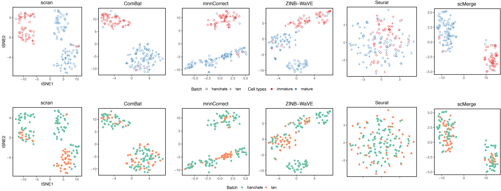

## Introduction 

This is a mouse neuronal single-cell data comprising of 2 different experiments. 

### Integration challenge

+ Prior to integration, there is a strong separation effect by experiments and batches.  

## Data description

+ Data source: 

| Type of merge                |   | Name     |   | ID        | Author   | DOI or URL              | Protocol   | Organism | Tissue   | # of cell types | # of cells | # of batches |
|------------------------------|---|----------|---|-----------|----------|-------------------------|------------|----------|----------|-----------------|------------|--------------|
| Across different experiments |   | Neuronal |   | SRP065920 | Tan      | 10.15252/msb.20156639   | Smart‐Seq2 | Mouse    | Neuronal | 2               | 145        | NA           |
|                              |   |          |   | GSE75413  | Hanchate | 10.1126/science.aad2456 | STRT-seq   |          |          |                 |            |              |

+ Relation to the `scMerge` article: Supplementary Figure 10. 

## Data visualisation

### tSNE plots by cell types and batch

{width=100%}

## Integrated `scMerge` data

+ Data availability: [Mouse Neuronal Data (in RData format)](http://www.maths.usyd.edu.au/u/yingxinl/wwwnb/scMergeData/neuronal_scMerge.rds)

+ `scMerge` parameters for integration: 

    - Unsupervised scMerge
    - kmeans K = (2,2)
    - Negative controls are mouse scSEG
